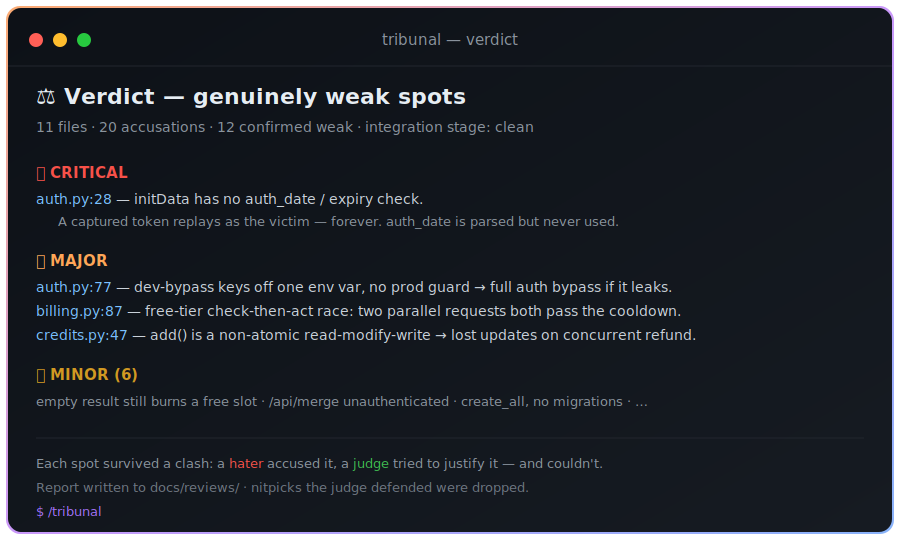

# Tribunal — put your code on trial


A Claude skill that runs an **adversarial code review** on your branch changes: a prosecutor accuses, the defense justifies, the verdict keeps only what's genuinely weak.



*An example verdict: only the spots that survived a hater's accusation **and** a judge's failed defense make the cut.*

Works in **Claude Code** and **Claude Cowork** (claude.ai) — in any repository, in any language. The reviewers are language-agnostic agents: Python, JS/TS, Go, Rust, Java and more out of the box (one config line to add yours).

---

## *What's GitHub?*

Think of GitHub as Google Drive, but for code. Instead of photos and files, people share code and snippets — like this skill. You're on a GitHub page right now.

---

## What's a skill?

A skill is a small set of instructions you give your AI — like a job description for a specific task. Once installed, you trigger it with a phrase and Claude knows exactly what to do.

This skill teaches Claude to put your code through a "tribunal": several agents with opposing roles tear the changes apart, defend them, and pass a verdict — surfacing the real weak spots instead of nitpicks.

---

## What it does

A normal one-model review gives you a single take: either a flat "looks fine" or a murky list where you can't tell a real problem from a matter of taste.

The tribunal solves this adversarially, in stages:

1. 🔥 **Hater** — one agent per file, biased, tears the changes apart (focused on the diff) as if an amateur wrote them.
2. 🔗 **Integration** — a separate agent hunts cross-module breakage: broken contracts, out-of-sync calls, places forgotten in the change.
3. ⚖️ **Judge** — for each accusation, digs into the code and decides: was this deliberate and justified?
4. 📜 **Verdict** — keeps only the spots the judge couldn't defend *or* conceded are weak.

The output is a report in `docs/reviews/` plus a short chat summary: what to actually fix, ranked by severity.

---

## When to use it

- Before merging a branch — "what's actually bad here?"
- After shipping a large multi-file feature — to catch integration bugs.
- When you want an honest, mean review instead of a polite "looks good".

What it does **not** do: it won't audit all your old code wholesale — it judges only the current branch's diff against the base.

---

## How to install it (no terminal needed)

Either option works in Claude Code and Claude Cowork.

### Option 1: Let Claude install it for you

Open a new chat in Claude and paste this in:

> Please install this Claude skill for me. The SKILL.md file lives in this GitHub repo: https://github.com/hekman316/claude-skill-tribunal
>
> Set it up globally so it works in all my repositories. Walk me through anything you need from me.

Claude will fetch the file and drop it in the right place (`~/.claude/skills/tribunal/`). If it can't do it automatically, it'll tell you exactly what to click.

### Option 2: Download the file and ask Claude to set it up

1. Click [SKILL.md](./SKILL.md) at the top of this repo.
2. Click the download button on the right of the file view to save it.
3. Open Claude and paste this in:

> I just downloaded a file called SKILL.md for the Tribunal skill. Install it globally so it works in all my repositories, and walk me through where to put it.

---

## How to use it

Once installed, in any repository just say:

- `/tribunal` — review the whole diff of the current branch;
- `/tribunal content` — only files whose path contains `content` (a sub-filter);
- "tribunal", "run the tribunal", "tear this code apart", "hard-review the diff" — also triggers.

Claude collects the diff, runs hater → integration → judge → verdict, and delivers a report plus summary.

---

## Configuration

The top of `SKILL.md` has a `CONFIG` block you can edit:

```
BASE_BRANCH   = main      # what to diff against (falls back to master)
EXTENSIONS    = .py .js .ts .go .rs .java ...   # languages to review; empty = all text files
EXCLUDE_GLOBS = node_modules/  .venv/  vendor/  target/  ...
INCLUDE_TESTS = yes       # no — skip tests/
MAX_FILES     = 40        # circuit breaker for large diffs
PARALLEL      = 6         # how many agents per batch
```

---

## How it works

The skill is portable: all orchestration runs through Claude's sub-agents (the `Agent` tool), with no external runtimes or dependencies. The balance comes from the clash *between* agents, not from any single one — the hater is deliberately biased, the judge deliberately looks for justification, and only their collision yields an honest signal.

---

## License

MIT — see [LICENSE](./LICENSE). Use it, fork it, ship it.
